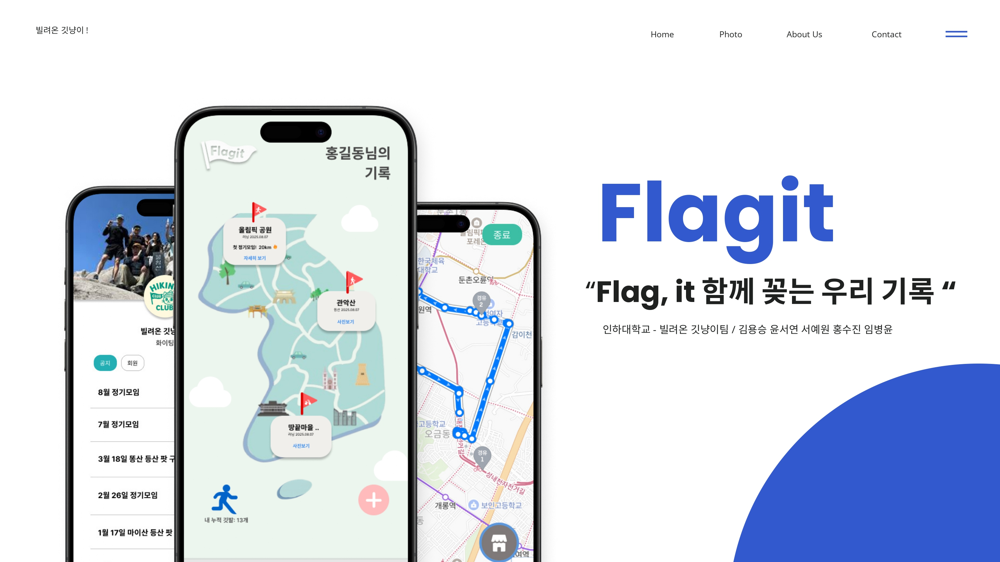
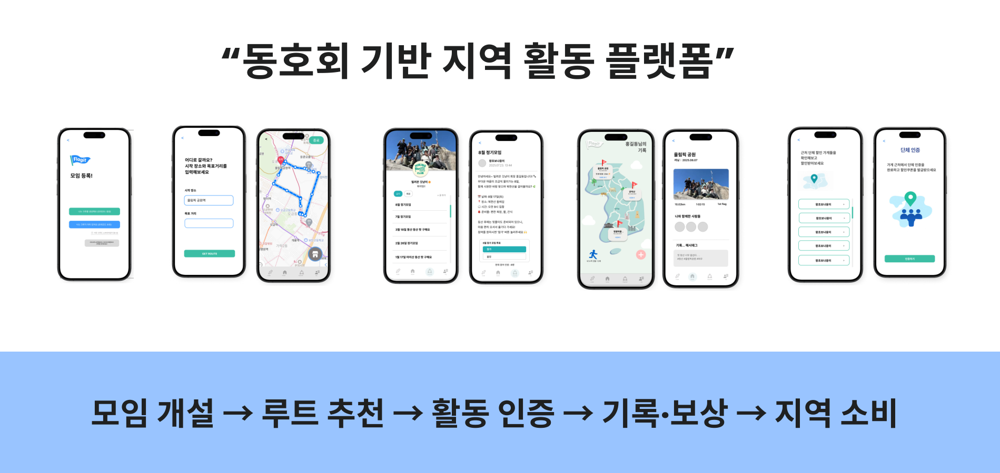

  <h1>🚩 Flagit - Flag, it 함께 꽂는 우리 기록</h1>
  
🏁 동호회·크루의 활동 동선을 기록하고, 지역 상권과 연결해 주는 동호회 기반 지역 활동 플랫폼 🏁

 

  

 
  
👥 구성원: 서예원 · 윤서연 · 김용승 · 홍수진 · 임병윤 

  ---

## 👀 프로젝트 개요

### 문제 인식
- 지역 경제 활성화를 위해 **유동 인구**와 **지역 소비**를 늘려야 하지만  
  실제로는 소모임·동호회 활동과 지역 상권 사이의 연결 고리가 약함
- 단체로 꾸준히 활동해도
  - 공식적인 혜택이 거의 없고
  - 활동할 루트/코스를 매번 직접 찾아야 하며
  - 단체 할인/제휴 정보가 체계적으로 제공되지 않음

### 해결 방안

**Flagit**은 모임(크루)들이 활동하면서 자연스럽게 지역 상권을 이용하고,  
그 기록을 쌓아 **혜택·보상**까지 받을 수 있는 플랫폼을 지향합니다.

> 모임 개설 → 루트 추천 → 활동 인증 → 기록·보상 → 지역 소비

---

## 💡 서비스 한 줄 소개

> **"동호회 기반 지역 활동 플랫폼"**  
> 모임이 움직이는 만큼, 지역이 함께 뛰는 서비스

---

## 🔧 핵심 기능

### 1. 크루 운영
- 동호회/크루 생성 및 멤버 관리
- 정기 모임 일정 관리
- 활동 내역(날짜, 코스, 인원 수 등) 기록

### 2. 루트 추천

- 지역 기반 추천 코스 제공
- 제휴 가게를 중심으로 맞춤 루트 제공
- 모임의 과거 활동 데이터를 활용한 **맞춤형 루트 추천(고도화 예정)**

### 3. 제휴 할인 · 단체 혜택

- 활동 루트 인근 **제휴 매장/상권 정보** 제공
- 단체 방문 시 적용 가능한 할인·쿠폰·포인트 등 안내
- 지역 상권과의 제휴를 통해 **단체 손님 유치 및 홍보 지원**

### 4. 기록화 & 리워드
- 방문한 장소, 이동 루트, 참여 인원 등을 시각적으로 기록
- 활동 기록에 따라 뱃지 부여 등 재미요소 제공

## ‼️ 기존 서비스와의 차별점

기존 커뮤니티(오픈채팅방, 네이버 카페 등)는  
- 모임 **모집과 대화**에 초점이 맞춰져 있고  
- 루트 추천, 단체 할인, 활동 기록은 각자 해결해야 합니다.

**Flagit**은 다음에 초점을 둡니다.

- 루트 추천 + 단체 혜택 + 활동 기록을 **하나의 흐름으로 통합**
- 동호회를 단순 유저가 아닌, **지역 소비를 만들어 내는 핵심 주체**로 인식
- 지역 상권은 경쟁 서비스가 아니라 **플랫폼의 고객이자 파트너**

---

## 🌏 기대 효과

### 사용자(크루·개인)

- 활동 준비 시간 단축 (루트·장소·혜택을 한 번에 확인)
- 나와 우리 크루의 활동이 지도로 남는 **성취감·소속감**
- 공식적인 단체 혜택을 통한 **경제적 이득**

### 지역 상권·지자체

- 동호회·크루 단체 손님 유치 및 홍보 효과
- 외부 방문객 유입을 통한 **지역 경제 활성화**
- 데이터 기반으로 실제 **유동 인구·활동 동선**을 파악할 수 있는 인사이트

### 플랫폼(Flagit)

- 사용자와 상권을 연결하는 **중개 수수료·제휴 수익 모델**
- 축제/행사/테마 루트 등 다양한 **광고·프로모션 모델** 확장 가능

## 🧑‍💻 팀원 소개

| **이름**    | **역할**        | **GitHub** |
|:-----------:|:---------------:|:-----------:|
| 서예원      | 팀장 & FE & Design | [@yewon2ee](https://github.com/yewon2ee)
| 홍수진      | FE & Design     | [@hongsujin2eeZyo](https://github.com/hongsujin2eeZyo)
| 임병윤      | FE & Design      | [@ByeongYun0608](https://github.com/ByeongYun0608)
| 윤서연      | BE & AI         | [@zeoueon](https://github.com/zeoueon)
| 김용승      | BE & Infra    | [@yongyong213](https://github.com/yongyong213)

---
## ⚙️ 기술 스택

<table>
  <thead>
    <tr>
      <th>분류</th>
      <th>기술 스택</th>
    </tr>
  </thead>
  <tbody>
    <tr>
      <td>프론트엔드</td>
      <td>
        
        
        
        
      </td>
    </tr>
    <tr>
      <td>백엔드</td>
      <td>
        
        
        
        
      </td>
    </tr>
    <tr>
      <td>인프라</td>
      <td>
        
        
        
        
        
      </td>
    </tr>
    <tr>
      <td>협업</td>
      <td>
        
        
        
        
        
      </td>
    </tr>
  </tbody>
</table>
